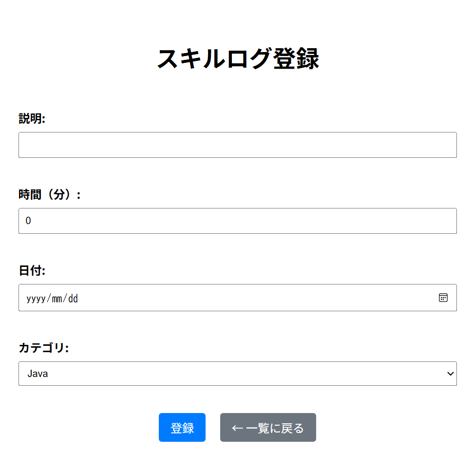

# SkillLog アプリ

副業・スキル学習など、日々の取り組みを記録・管理できるWebアプリです。  
シンプルな構成で、学習進捗やスキルの可視化をサポートします。

---

## 📌 主な機能

- スキルログの新規登録
- 一覧表示（降順）
- 編集・削除
- カテゴリ別の表示（予定）

---

## 🛠 使用技術

- Java 17
- Spring Boot 3.2.x
- Thymeleaf
- H2 Database（組み込みDB）
- Maven（ビルド管理）

---

## 🚀 セットアップ方法

以下の手順でローカル環境にセットアップできます。

```bash
git clone https://github.com/your-username/skilllog-app.git
cd skilllog-app
./mvnw spring-boot:run
```

---

## 📸 スクリーンショット

### 📋 登録画面


### 📝 一覧画面


---

## ✅ 補足：使い方

- **ファイル名**：`README.md`
- **場所**：プロジェクトのルートディレクトリ（`src/`と同階層）に置く
- **画像追加**：
  - スクショ画像を `/images/` フォルダに保存して、
  ```markdown
  


---
## 🔧 今後の実装予定

- ログイン機能（Spring Security）
- Bootstrap導入によるUI改善
- タグによる絞り込み／検索


